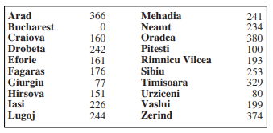
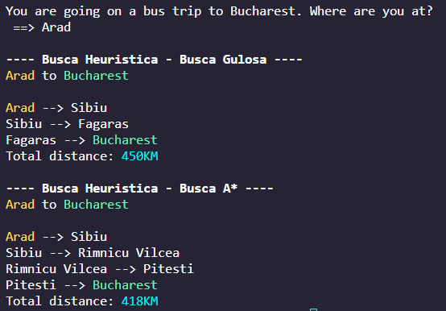
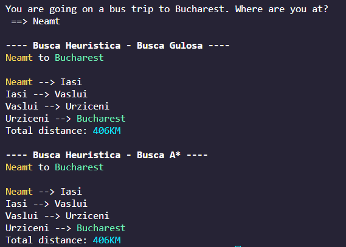
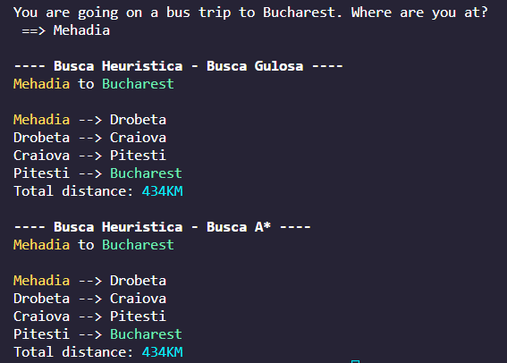
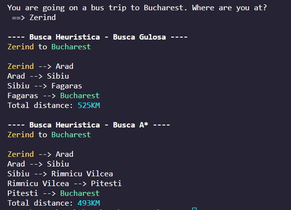

# Inteligência Artificial - 2022.2

## Atividade - Mapa da Romênia - Busca Heurística - Gulosa/A*

### Descrição
A atividade é baseada em um mapa rodoviário do país da Romênia:
 

 

Dado o mapa, pede-se que seja feita uma **busca heurística** para achar a distância total entre um dado estado (dito por um input do usuário) e o estado de Bucareste (*Bucharest*), bem como o caminho completo (todos os estados percorridos no processo). Para efeitos de imaginação, supomos que um usuário irá viajar de ônibus de algum estado para Bucareste, e deseja saber o caminho e a distância que irá percorrer.

 

### Objetivo
O objetivo da atividade é apenas mostrar o caminho percorrido e a distância total entre um estado e Bucareste, por meio de uma **busca heurística**.  
Para essa busca, temos um tipo de dado adicional: a distância de cada cidade até a cidade alvo (Bucareste), **em linha reta**. Os dados são os seguintes:
 

 
Baseado nesses dados, utilizamos os seguintes métodos de busca:

1. **Busca Gulosa**: a busca é baseada apenas na distância em linha reta.   Ou seja, dado um estado, ele irá percorrer os estados com a menor distância **em linha reta** até Bucareste.

2. **Busca A***: esta busca é similar à anterior, adicionalmente considerando a distância de um estado até o primeiro estado dado.
Ou seja, a fórmula considerada aqui é   __*distância em linha reta* + *distância do estado atual do estado inicial*__ 
O estado que tiver o menor valor nesta fórmula é escolhido para ser percorrido.

 

### Imagens

* Exemplo: **Arad** como estado inicial

 

 

* Exemplo: **Neamt** como estado inicial

 

 

* Exemplo: **Mehadia** como estado inicial

 

 

* Exemplo: **Zerind** como estado inicial

 

 

* **ERRO**: **Bucharest** como estado inicial - não se pode viajar para um estado se você já está nele!

 

 

* **ERRO**: Estado inicial inválido - não existe ou não é um estado da Romênia.

 

 