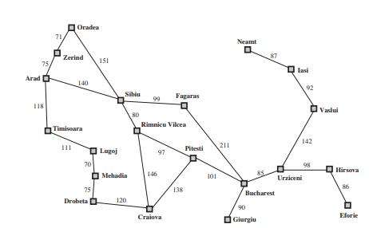
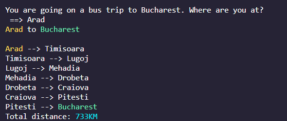
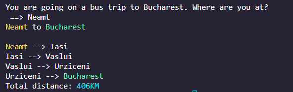
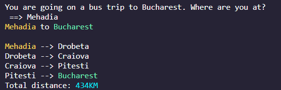
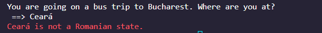

# Inteligência Artificial - 2022.2

## Atividade - Mapa da Romênia - Busca por Profundidade

### Descrição
A atividade é baseada em um mapa rodoviário do país da Romênia:
 

 

Dado o mapa, pede-se que seja feita uma **busca por profundidade** (método *LIFO* - Last In First Out) para achar a distância total entre um dado estado (dito por um input do usuário) e o estado de Bucareste (*Bucharest*), bem como o caminho completo (todos os estados percorridos no processo). Para efeitos de imaginação, supomos que um usuário irá viajar de ônibus de algum estado para Bucareste, e deseja saber o caminho e a distância que irá percorrer.

 

### Objetivo
O objetivo da atividade é apenas mostrar o caminho percorrido e a distância total entre um estado e Bucareste, por meio de uma **busca por profundidade**.

 

### Imagens

* Exemplo: **Arad** como estado inicial

 

 

* Exemplo: **Neamt** como estado inicial

 

 

* Exemplo: **Mehadia** como estado inicial

 

 

* **ERRO**: **Bucharest** como estado inicial - não se pode viajar para um estado se você já está nele!

 

 

* **ERRO**: Estado inicial inválido - não existe ou não é um estado da Romênia.

 

 