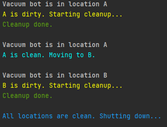
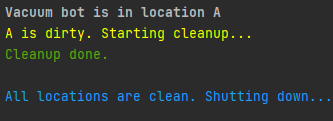
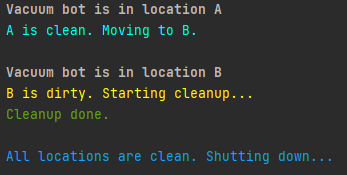
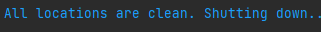

# Inteligência Artificial - 2022.2

## Atividade - Vacuum World

### Descrição
A atividade consiste em criar o algoritmo para um robô aspirador automático, em um ambiente com duas salas (A e B), onde inicialmente ambos estão sujos. O robô começa na sala A. O arquivo em PDF da atividade apresenta mais detalhes.

 

### Objetivo
O objetivo da atividade é mostrar todos os passos do robô aspirador, onde o objetivo deste é limpar todas as salas sujas e, então, desligar. No código, estão descritos os passos do robô, como a sua posição atual, situação da sala em que o robô está presente e sua respectiva ação.

 

### Prints

* Configuração inicial (A e B sujos)

 

 

* A sujo, B limpo

 

 

* A limpo, B sujo

 

 

* Todos limpos

 

